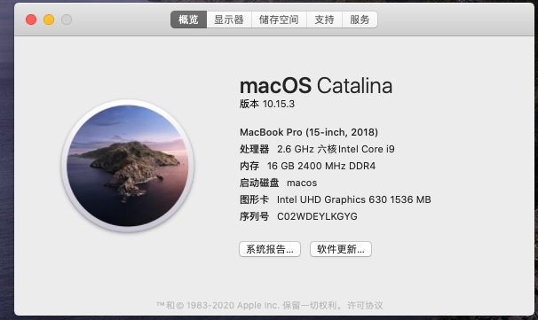
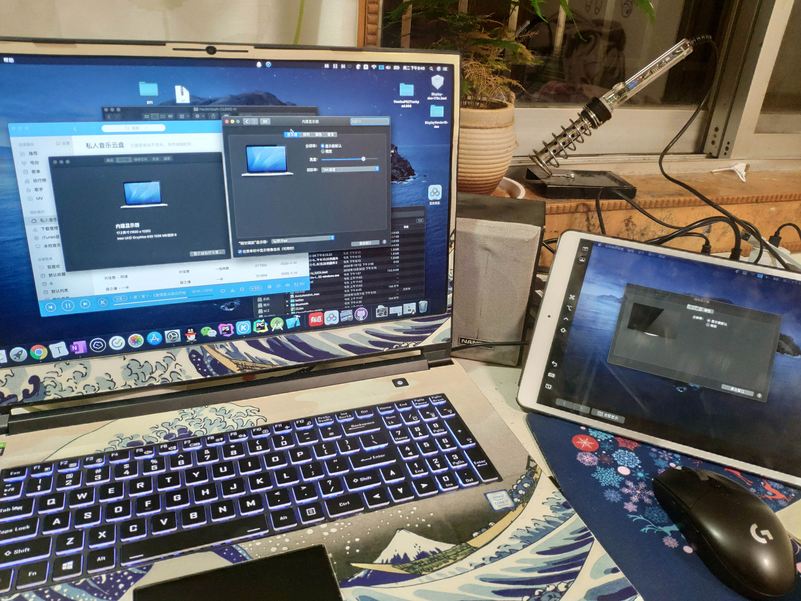

# Hackintosh-CLEVO-H
## 神舟战神炫龙蓝天 8/9 代全系机型(标压) macOS 10.15 Catalina EFI  NH5xRD_RC_RA_RH(Q)/NH70RD_RC_RA_RH(Q) 

+ 用的是黑果小兵的15.3镜像https://blog.daliansky.net/macOS-Catalina-10.15.3-19D76-Release-version-with-Clover-5103-original-image-Double-EFI-Version.html
+ 必须要冷启动，必要时候通过win关机再启动

+ 好用的话记得star一下😊

已经测试的机型包括我的G8-ct7na和我室友的G7还有一个同学的

## 功能驱动情况

### 1.正常使用的功能：

- 1.15.3可用
- 睿频、变频正常
- Intel UHD630
- 亮度调节完美（可在设置中调节；可使用 Fn+F11, Fn+F12 快捷键调节亮度）
- 触摸板 添加了ApplePS2SmartTouchPad.kext不过效果不好，只能算凑合用（默认不添加，想使用自己下载）
- 有线网卡
- 无线网卡的话我在双12买了个94360+转接器，直接完美使用
- 1820a之前尝试过，可以用，但。。太难用了，总之不是想吧黑苹果当主力的最好别入坑
- 声音 基本完美
- 电池状态（使用 ACPIBatteryManager.kext驱动）基本可用
- USB3.0满速
- type-c全功能
- 摄像头
- MiniDP 可以驱动
- 随航基本完美
- etc.

### 2.无法使用的功能：

- 独立显卡（目前没有任何解决方案）
- HDMI（该模具 HDMI 直接由独显输出, 独显无法驱动，所以 HDMI 也无法使用）
- 无线网卡（Intel AC9462/9560 无解，使用蓝牙共享网络、USB共享网络或者USB网卡替代，或更换无线网卡）或许有解了？
- 读卡器（读卡器走的 USB 2.0 外置，无法使用）
- 睡眠

### 3.待完善的功能

+ 触摸板——希望有大佬能搞定VoodooI2c,我是从入门到放弃了😌
+ 睡眠💤

### 3.注意事项

- 不兼容同方模具想要同方摸具的去http://bbs.pcbeta.com/forum.php?mod=viewthread&tid=1829014&highlight=%D5%BD%C9%F1
- 若系统无法正常安装，请参考下面的常见问题解决链接。
- 随航 Sidecar 功能使用的条件较为苛刻，需要支持 pencil 、更新到 iPadOS13 的 iPad（2018+, mini5, Air3, Pro2017+），macOS 与 iPad 登录同一个 iCloud ID（并且该 ID 需要开启双因素认证）并使用有线连接后在 Finder 中互相设为信任设备、在蓝牙中能搜索到对方，方可使用。
- 还是随航，当使用过随航后，必须要记住你的设备id，不能随便改

#### 下载地址： 
链接: https://pan.baidu.com/s/1RTH8nS-O4KTVxKwVUI9WMw  密码:jtql
        
        https://github.com/lyj0309/Hackintosh-CLEVO-H/releases

+ 希望大家早日吃上完美黑果

